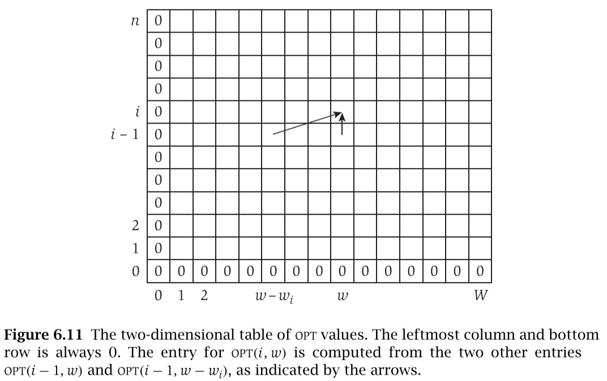
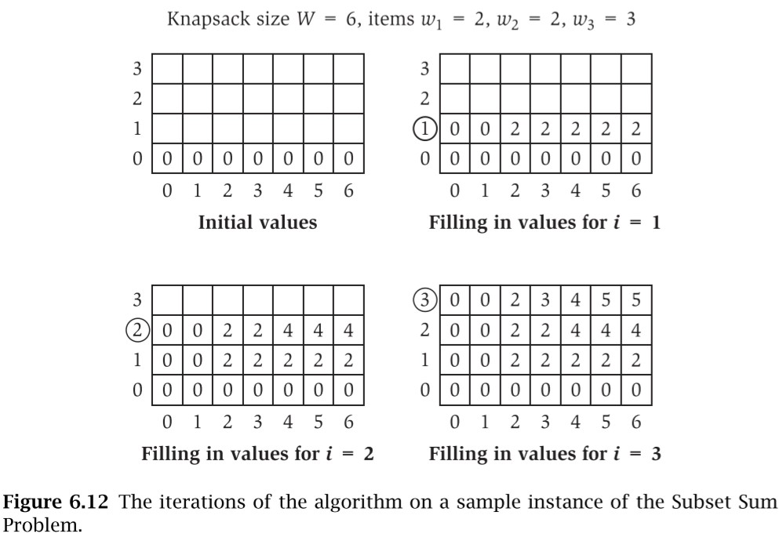
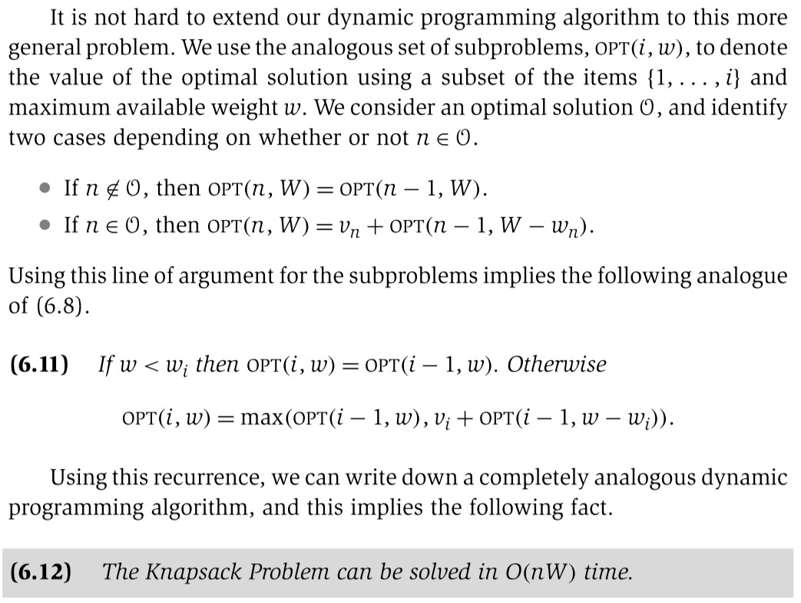

# Subset Sums and the Knapsack Problem

These are dynamic programming problems.

We can solve Subset Sums in O(n*W) + O(nW) time such that `n` is the number of items and `W` is the max weight. It's essentially O(N^2) such that `N` is the larger of `n` and `W`.

In Subset Sums we are optimizing for max weight (maximum use of resources), whereas in Knapsack we are optimizing for max value without going over the max weight.

Subset Sums is a special case of Knapsack such that the values are equal to the weights.

## Subset Sums

> From Kleinberg & Tardos (2005), section 6.4.

We are given `n` items `{1, ... , n}`, and each has a given nonnegative weight `w_i` (for `i = 1, ... , n`). We are also given a bound `W`. We would like to select a subset `S` of the items so that the sum of `w_i` for all `i` in `S` is `<= W`, and subject to this restriction, that sum is as large as possible.

### Pseudo-code solution

> **Recurrence 6.8**
>
> If `w < w_i`, then `OPT(i, w) = OPT(i - 1, w)` (exclude this item).
>
> Otherwise, `OPT(i, w) = max(OPT(i - 1, w), w_i + OPT(i - 1, w - w_i))` (choose the max between excluding and including this item).

We want to design an algorithm that builds up a table of all `OPT(i, w)` values while computing each of them at most once.

```txt
Subset-Sum(n, W)
  Array M[0..n, 0..W]
  Initialize M[0, w] = 0 for each w = 0, 1, ... , W
  For i = 1, 2, ... , n
    For w = 0, ... , W
      Use the recurrence (6.8) to compute M[i, w]
    Endfor
  Endfor
  Return M[n, W]
```





## Knapsack Problem

Subset Sums is a natural special case of a more general problem called the **Knapsack Problem**, where each request `i` has both a value `v_i` and a weight `w_i`. The goal in this more general problem is to select a subset of maximum total value, subject to the restriction that its total weight not exceed `W`. Knapsack problems often showup as subproblems in other, more complex problems. The name knapsack refers to the problem of filling a knapsack of capacity `W` as full as possible (or packing in as much value as possible), using a subset of the items `{1, ... , n}`. We will use *weight* or *time* when referring to the quantities `w_i` and `W`.


